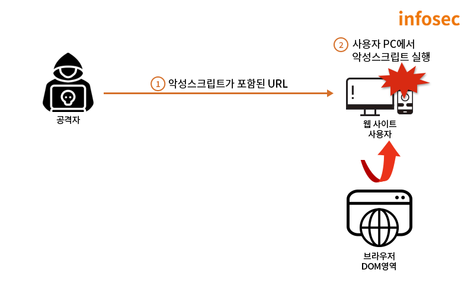

# xss 공격이란?

XSS(Cross Site Scripting)란 공격자가 웹사이트에 악성 스크립트를 삽입하여, 해당 웹사이트에 방문한 다른 사용자의 브라우저에서 스크립트가 실행되도록 하는 클라이언트 측 코드 삽입 공격이다. 이 공격을 통해 공격자는 사용자의 쿠키, 세션 토큰 등을 탈취하거나 악성 코드를 실행시켜 정보를 훔치거나 시스템을 손상시킬 수 있다.

XSS는 대표적으로 저장형(Stored), 반사형(Reflected), DOM 기반(DOM-based) 세 가지 유형으로 나뉜다.

## 저장형(Stored) XSS
Stored XSS는 악성 스크립트를 서버의 데이터베이스에 저장(Stored)하는 형태의 공격이다. 
게시판처럼 주로 사용자에게 입력받은 값을 서버에 저장해놓고, 저장해놓은 내용을 다시 사용자에게 출력하는 곳에서 발생한다. 


예시) 
공격자가 악성 스크립트를 포함된 게시글을 작성해 게시판에 업로드하고 서버가 입력값을 적절히 필터링하지 않고 그대로 데이터베이에 저장한다. 
다른 사용자가 해당 게시글을 읽기 위해 get요청을 보내면 서버는 데이터베이스에서 악성 스크립트가 있는 게시글을 그대로 가져와 사용자에게 전송한다. 
사용자 브라우저에서 해당 글을 렌더링하는 과정에서 숨겨진 악성 스크립트를 정상적인 코드로 오인해 실행 된다.

```
// 글 생성 페이지
<input id="title" placeholder="제목" />
<textarea id="content" placeholder="본문"></textarea>
<button onclick="submitPost()">등록</button>

<script>
  // 서버로 글 생성 요청
</script>
```

```
// 글 조회 페이지
<h2>게시판</h2>
<div id="posts"></div>

<script>
  const postId = 1;
  fetch(`/posts/${postId}`)
    .then(res => res.json())
    .then(post => {
      const container = document.getElementById("post");
      container.innerHTML = `
        <h1>${post.title}</h1>
        <p>${post.content}</p>
      `;
    });
</script>
```

글 생성 페이지에서 제목 인풋에  이런 값을 넣어 글을 생성하면 글을 조회할때 img태그에서 이미지 주소인 x를 불러오려고 시도하지만 주소가 잘못되었으므로 에러가 발생하고 에러 발생 시 실행되는 onerror속성이 실행된다. 해당 코드의 경우 해커의 서버에 브라우저의 쿠키값을 URL파라미터로 보내는 코드이고 공격자 서버의 로그에 사용자의 쿠키 정보가 기록이 되게된다.


## 반사형(Reflected) XSS
Reflected XSS는 URL 주소 뒤에 붙는 쿼리에 악성 스크립트 작성하여 전달하는 형태의 공격이다. 
사용자가 URL에 접속하면 스크립트가 서버를 거쳐 사용자 브라우저에서 실행됩니다.


예시)
```
// server.js
app.get("/search", (req, res) => {
  const q = req.query.q;

  res.send(`<p>검색어: ${q}</p>`);
});
```

해당 코드는 글을 검색하는 코드이고 URL에서 query 파라미터 추출하여 그대로 출력하는 코드이다. 여기서 query 파라미터에 악성 스크립트(<script>alert(1)</script>)를 넣고 해당 URL로 접속한다면, 서버에서 브라우저로 <p>검색어: <script>alert(1)</script></p>를 응답으로 보내고 브라우저에서 해당 값을 렌더링하는 중 스크립트가 실행된다. 


## DOM 기반(DOM-based) XSS
DOM-based XSS는 서버를 거치지 않고, 브라우저 내부의 자바스크립트가 악성 스크립트를 스스로 실행해버리는 공격 방식이다.
URL에 숨겨진 악성 스크립트가 DOM 환경에서 실행된다.
Stored XSS 및 Reflected XSS는 서버에서 악성 스크립트의 공격이 이루어지기 때문에 위험 징후를 발견할 수 있지만, DOM Based XSS는 브라우저에서 바로 공격이 이루어지기 때문에 취약점을 쉽게 발견할 수 없다는 특징이 있다



예시)
```
<h2>환영합니다, <span id="user-name"></span>님!</h2>

<script>
  // 1. Source: URL의 파라미터에서 'name' 값을 가져옴
  const params = new URLSearchParams(window.location.search);
  const name = params.get('name');

  // 2. 검증 없이 innerHTML을 통해 화면에 출력
  if (name) {
    document.getElementById('user-name').innerHTML = name;
  }
</script>
```

해당 코드는 URL의 파라미터에서 name값을 가져와 화면에 보여주는 코드이다. 만약 http://example.com/?name=이라는 경로로 접속한다면 img태그가 그대로 페이지에 삽입되고 img태그에서 이미지 주소인 x를 불러오려고 시도하지만 주소가 잘못되었으므로 에러가 발생하고 에러 발생 시 실행되는 onerror속성이 실행된다.

```
<h2 id="current-tab">선택된 탭: 기본 홈</h2>

<script>
  // 1. Source: URL Fragment(#) 뒤의 값을 가져옴
  // 예: http://example.com/#dashboard -> "dashboard" 추출
  const hashValue = decodeURIComponent(window.location.hash.substring(1));

  // 2. Sink: 가져온 값을 검증 없이 innerHTML에 넣음
  if (hashValue) {
    document.getElementById('current-tab').innerHTML = "선택된 탭: " + hashValue;
  }
</script>
```
해당 코드는 URL 프래그먼트에 값을 가져와 화면에 보여주는 코드이다. 만약 http://example.com/#이라는 경로로 접속한다면 방금과 같이 x를 불러오지 못하고 onerror를 실행하게 된다

## 보안 대책
출력 값 이스케이핑 (Escaping)
스크립트의 핵심 기호(<, >, ', ")를 HTML Entity(&lt;, &gt; 등)로 치환하여 브라우저가 코드가 아닌 일반 문자로 인식하게 한다.

HTML 살균 (Sanitizing)
HTML 태그 렌더링이 필요한 경우, DOMPurify, sanitize-html 등의 라이브러리를 사용하여 악성 스크립트(이벤트 핸들러 등)만 제거 후 출력한다.

HttpOnly 쿠키
쿠키를 생성할 때 HttpOnly 속성을 추가하여, 브라우저의 자바스크립트(document.cookie)가 쿠키 값에 접근하는 것을 원천 차단하여 세션 토큰이나 로그인 정보가 탈취되는 것을 방지한다.

안전한 API 사용 지침
innerHTML, dangerouslySetInnerHTML, eval(), document.write() 등 문자열을 코드로 실행할 위험이 있는 API 사용을 지양하고, textContent 등 안전한 대안을 사용한다.

참고자료 <br />
https://4rgos.tistory.com/1 <br />
https://pandyo.tistory.com/entry/XSS-Cross-Site-Scripting#DOM%20Based%20XSS-1 <br />
https://velog.io/@swj9077/XSS-%EA%B3%B5%EA%B2%A9%EC%9D%98-%EC%9C%A0%ED%98%95%EA%B3%BC-%EB%8C%80%EC%B2%98%EB%B0%A9%EB%B2%95 <br />
https://www.skshieldus.com/blog-security/security-trend-idx-06 <br />
https://www.fis.kr/ko/major_biz/cyber_safety_oper/attack_info/security_news?articleSeq=3408 <br />
https://seahippocampus.tistory.com/149 <br />
https://annann5026.medium.com/react%EC%97%90%EC%84%9C-%EB%B0%9C%EC%83%9D%ED%95%A0-%EC%88%98-%EC%9E%88%EB%8A%94-xss-%EA%B3%B5%EA%B2%A9-d922b5dc1251