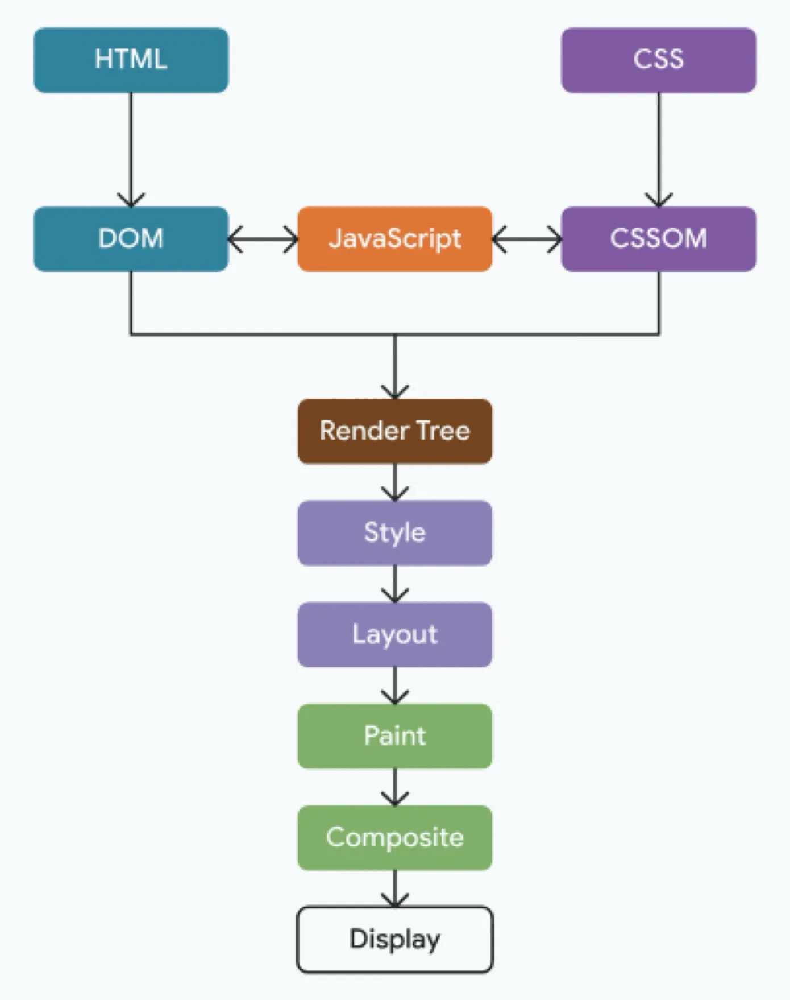
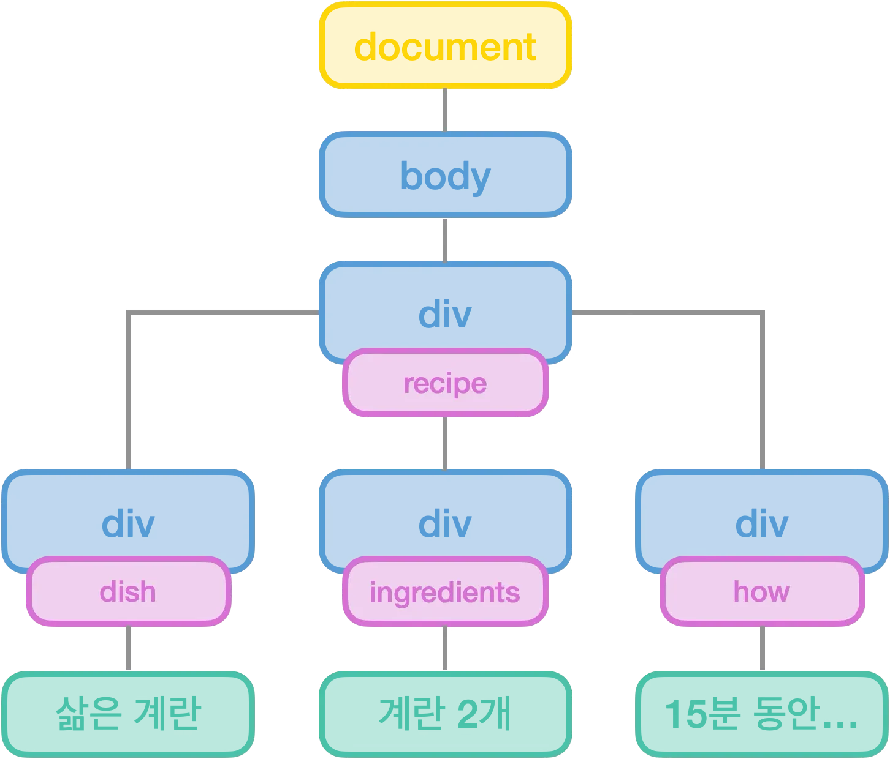
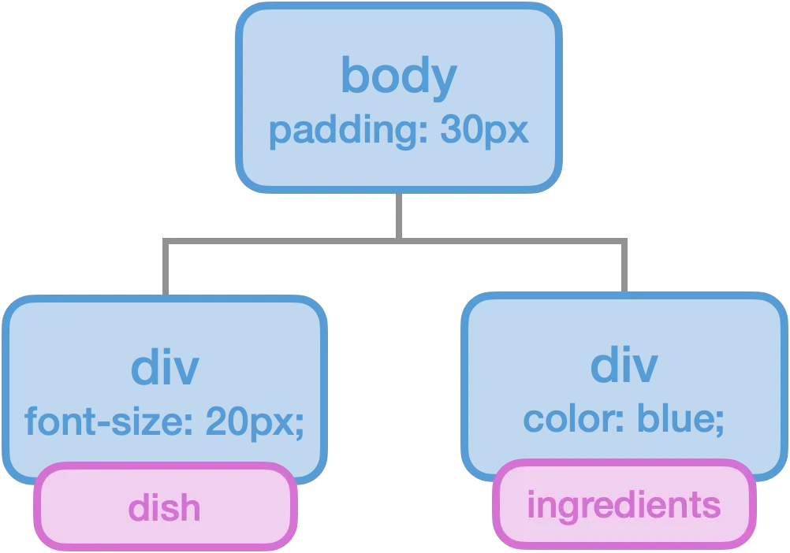
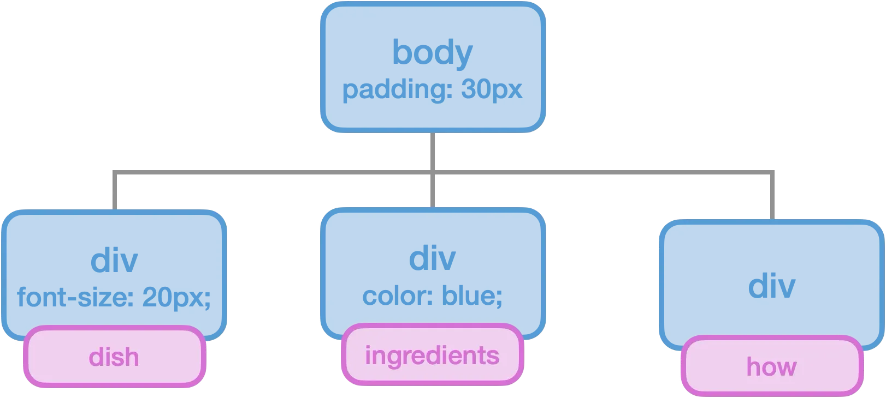
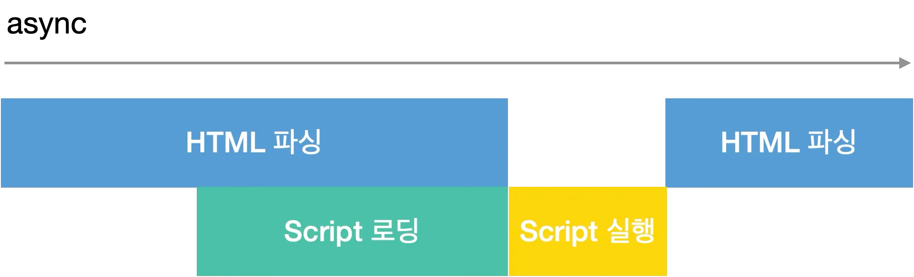
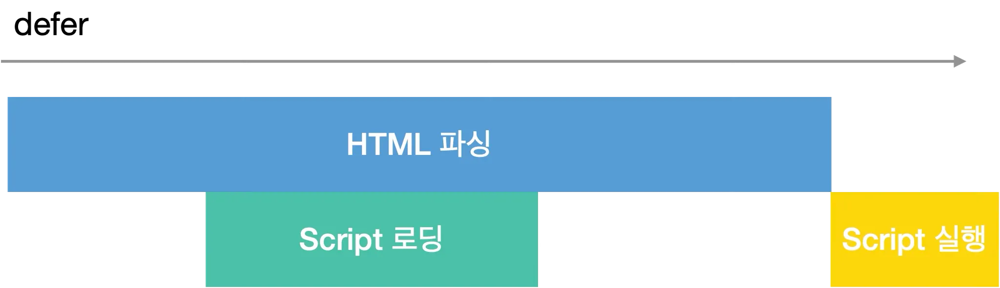
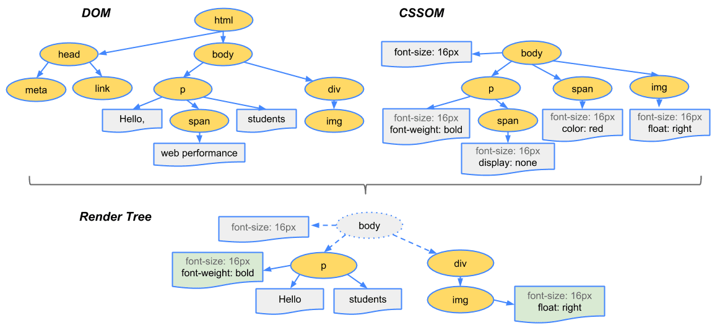
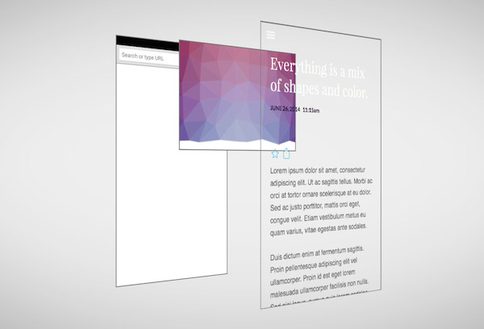

# 브라우저는 어떻게 렌더링 할까

## 렌더링이란
브라우저가 html, css, js를 해석해, 우리가 보는 화면에 실제로 나타나는 과정



## 1) HTML 파싱 및 DOM 트리 생성
브라우저는 HTML 파일을 읽고 DOM(Document Object Model) 트리를 생성한다. DOM은 HTML문서의 계층적 구조를 표현하는 객체 모델로, 브라우저가 HTML로 작성된 여러 요소들을 js가 이해하고 조작할 수 있게 변환시킨 객체이다.

DOM 트리에서 각 노드는 HTML 태그를 나타낸다

```
<!DOCTYPE html>
<html>
    <body>
        <div class="recipe">
            <div class="dish">삶은 계란</div>
            <div class="ingredients">계란 2개</div>
            <div class="how">15분 동안 물을…</div>
        </div>
    </body>
</html>
```


## 2) CSS 파싱 및 CSSOM 트리 생성
DOM 트리를 생성 하며 동시에 브라우저는 CSS 파일을 읽어 CSSOM(CSS Object Model) 트리를 생성한다. CSSOM은 CSS를 파싱하여 트리 구조로 표현한 객체 모델로, HTML 문서의 각 요소에 적용된 CSS 스타일 규칙을 나타내며, DOM과 결합해 화면에 표현될 준비를 한다. 

```
.body {
  padding: 30px;
}
.dish {
  font-size: 20px;
}
.ingredients {
  color: blue;
}
```


## 3) 렌더 트리 형성
DOM과 CSSOM이 다 생성되면 DOM과 CSSOM을 겹합해 렌더 트리(Render Tree)를 생성한다. 


단 DOM트리 생성 중 <script> 태그를 만나면 DOM 생성을 즉시 중단한다(파서 차단)
js 실행은 CSSOM이 완성될 때까지 대기한다. (js는 스타일 정보를 변경하거나 가져올수 있기 때문에)
CSSOM이 완성되면 js가 실행되고 js 실행이 끝이나면 HTML 파싱을 중단했던 지점부터 다시 파싱을 시작해 DOM 생성을 완료한다. 

이후 완성된 DOM과 CSSOM을 합쳐 렌더 트리를 만든다.

하지만 이렇게 하면 사용자는 js를 실행하는 동안 사용자는 하얀 화면만 보고 있어야함.
이를 해결하기 위해 script 태그의 async와 defer 속성을 사용한다.

async는 스크립트를 비동기적으로 로드하고, 로드가 완료되는 즉시 실행하는 속성이다.
async 속성은 스크립트가 로드된 즉시 실행되며, 여러 스크립트가 있는 경우 로드가 완료된 순서되로 실행되기 때문에 실행 순서를 보장하기 어렵다는 단점이 있다.


defer는 async와 달리, 스크립트를 비동기적으로 로드하되, HTML 파싱이 완료된 이후 실행됨

script의 defer 속성을 사용하면 스크립트를 백그라운드에서 다운로드 하며 따라서 스크립트를 다운로드 하는 도중에도 HTML 파싱을 멈추지 않는다.
그리고 HTML 파싱이 완료된 후 js가 실행 된다

일반 스크립트: HTML 읽기 -> 중단 -> JS 다운로드 -> JS 실행 -> HTML 나머지 읽기 (직렬적)
defer 스크립트: HTML 읽기 + JS 다운로드 (동시 진행) -> HTML 완료 -> JS 실행 (병렬적)


단 defer와 async 속성은 src가 있는 외부 스크립트에만 유효하다.



## 4) 레이아웃
렌더 트리가 생성되면 브라우저는 각 요소의 위치와 크기를 계산하는 레이아웃 단계에 들어간다. 
이 과정에서 요소가 화면에서 어디에 위치할지, 그리고 어떤 크기를 가질지 등을 결정한다.

## 5) 페인트
레이아웃 단계 이후, 브라우저는 요소의 스타일과 내용을 바탕으로 화면에 픽셀을 그린다.
브라우저는 각 요소의 시각적인 속성을 기반으로 픽셀 데이터를 생성하며, 데이터들은 화면에 표시될 준비를 하는 단계이다.
페인트 과정에서 브라우저는 각 요소의 시각적인 속성을 기반으로 페인트 레이어를 생성한다.
요소의 특정 속성(z-index, position, opacity, <video>, <canvas> 등)에 따라 독립적인 레이어가 생성될 수 있다.

## 6) 컴포지팅
페인트 과정에서 생성된 여러 개의 레이어들은 컴포지팅 단계에서 하나의 화면으로 결합된다.


참고자료 <br />
https://ko.javascript.info/script-async-defer <br />
https://yozm.wishket.com/magazine/detail/2909/ <br />
https://velog.io/@zaman17/%EA%B8%B0%EC%88%A0%EB%A9%B4%EC%A0%91%EB%8C%80%EB%B9%84-%EB%B8%8C%EB%9D%BC%EC%9A%B0%EC%A0%80-%EB%A0%8C%EB%8D%94%EB%A7%81-%EC%88%9C%EC%84%9C%EC%99%80-%EC%9B%90%EB%A6%AC
